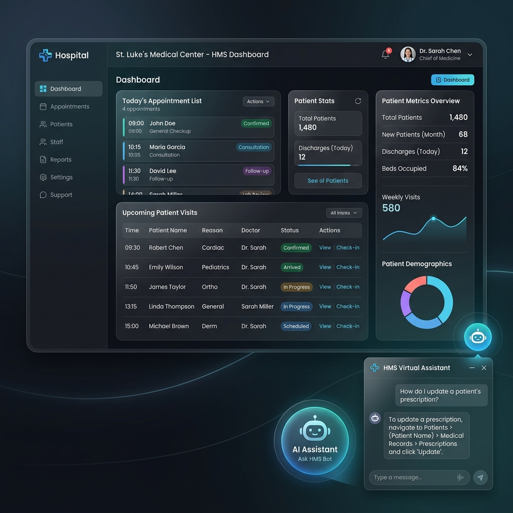

# 🏥 Hospital Management System (HMS)

[](https://react.dev/)
[](https://nodejs.org/)
[](https://www.mongodb.com/)
[](https://tailwindcss.com/)
[](https://deepmind.google/technologies/gemini/)

An enterprise-grade, highly secure, and responsive Hospital Management System (HMS) built with the MERN stack. It features robust Role-Based Access Control (RBAC), secure authentication guards, query optimizations, and an integrated AI Chatbot assistant with local offline fallback models.

---

## 🖥️ Application Preview



---

## 🌟 Core Architecture & Technical Highlights

- **👥 Role-Based Access Control (RBAC)**: Restricts interface layouts and API endpoints based on user roles:
  - **Patient**: Request and track appointment statuses, and access personal inquiry chat threads.
  - **Doctor**: View assigned appointments in a custom queue grid, review patient details, and manage appointment states (*Pending, Accepted, Rejected*).
  - **Admin**: Full dashboard management to register doctors, oversee system metrics, and resolve patient inquiries.
- **🛡️ Centralized Middleware Validation**:
  - Global error handling for duplicate database keys, validation issues, and route casting errors.
  - Custom authentication guards verifying signed JSON Web Tokens (JWT) inside HTTP-Only cookies.
- **⚡ Database Performance Tuning**:
  - Compound indexes on appointment tables: `{ patientId: 1, appointment_date: -1 }` and `{ doctor_id: 1, appointment_date: -1 }` for rapid retrieval.
  - Unique index constraints on user emails to secure authentication paths.
- **🤖 Integrated AI Assistant**:
  - Patient support desk powered by Google Gemini API.
  - Smart keyword-matching fallback system to service patients locally under API quota constraints.

---

## 📡 REST API Documentation

### 🔑 Authentication & Profiles (`/api/v1/user`)
| Endpoint | Method | Access Role | Description |
| :--- | :--- | :--- | :--- |
| `/register` | `POST` | Public | Register a Patient account. |
| `/login` | `POST` | Public | Login verification setting secure HTTP-Only cookies. |
| `/logout` | `GET` | Authenticated | Clears cookies and destroys auth session state. |
| `/me` | `GET` | Authenticated | Retrieve current user profile state. |
| `/doctors` | `GET` | Authenticated | Fetch active doctors list. |
| `/doctor/addnew` | `POST` | Admin Only | Register a doctor with profile image (Multer/Cloudinary). |

### 📅 Appointment Services (`/api/v1/appointment`)
| Endpoint | Method | Access Role | Description |
| :--- | :--- | :--- | :--- |
| `/post` | `POST` | Patient Only | Schedule an appointment. |
| `/appointmentget` | `GET` | Patient/Doctor | Fetch relevant appointments. |
| `/update/:id` | `PUT` | Doctor Only | Update appointment status. |
| `/delete/:id` | `DELETE` | Authenticated | Cancel/remove appointment record. |

---

## 📁 Codebase Structure

```text
Hospital Manage/
├── backend/
│   ├── Controllers/         # API Controllers for route logic
│   ├── database/            # Mongoose DB connection setup
│   ├── middleware/          # Auth, error, and file-upload middlewares
│   ├── models/              # Schema declarations (User, Appointment, Message)
│   └── index.js             # Express Entry file
└── frontend/
    ├── src/
    │   ├── components/      # UI components (Home, Profile, Helpdesk, Form, Chat)
    │   └── redux/           # Global state storage (Auth, Doctor lists)
```

---

## 🚀 Local Installation & Setup

### Prerequisites
- [Node.js](https://nodejs.org/) (v18+)
- [MongoDB](https://www.mongodb.com/) (Local or Atlas Cloud)
- [Cloudinary](https://cloudinary.com/) credentials (for image uploads)

### Step 1: Clone the Repository
```bash
git clone https://github.com/DIPANSHU66/Hospital_Mangement.git
cd Hospital_Mangement
```

### Step 2: Configure & Start Backend
1. Navigate to `backend/` and install dependencies:
   ```bash
   cd backend
   npm install
   ```
2. Create a `.env` file in the `backend/` folder:
   ```env
   PORT=8000
   MONGO_URI=your_mongodb_connection_string
   FRONTEND_URL=http://localhost:5173
   JWT_SECRET_KEY=any_secure_signing_salt
   CLOUD_NAME=your_cloudinary_name
   API_KEY=your_cloudinary_api_key
   API_SECRET=your_cloudinary_api_secret
   GEMINI_API_KEY=your_google_gemini_api_key (optional)
   ```
3. Run the development server:
   ```bash
   npm run dev
   ```

### Step 3: Configure & Start Frontend
1. Navigate to `frontend/` and install dependencies:
   ```bash
   cd ../frontend
   npm install
   ```
2. Create a `.env` file in the `frontend/` folder:
   ```env
   VITE_API_URL=http://localhost:8000/api/v1
   ```
3. Run the Vite development server:
   ```bash
   npm run dev
   ```
4. Access the portal at `http://localhost:5173`.

---

## 🛡️ License & Contributions
This project is open-source. Contributions, issues, and feature requests are welcome!

---

*Made with ❤️ by [Dipanshu Bansal](https://github.com/DIPANSHU66)*
